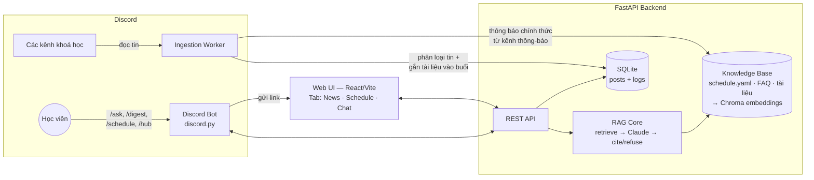

# MASTERPLAN — Personalized Discord Companion Agent

> **Hướng B — Trợ lý Học viên (Discord)** · Hackathon 2 ngày · Team 5 người · Stack Python
> Codename: **Companion** (tên chính thức chốt tại CP1)

---

## 1. Vision

Một trợ lý đồng hành cá nhân hoá cho học viên khoá AI Thực Chiến, gồm 3 cụm giá trị:

1. **Bản tin tổng hợp (News Digest)** — gom bài viết từ 2 nhóm kênh Discord của khoá: **kênh chat từng lớp** (`lý-thuyết`, `thực-hành-lab/Lab-XXX`…) và **kênh forum chia sẻ** (`hỏi-đáp`, `chia-sẻ`, `bài-học`) — agent phân loại theo **bộ loại tin do nhóm tự thiết kế** (taxonomy chốt sau, xem mục Nguồn digest).
2. **Trung tâm buổi học (Session Hub)** — lịch học, tài liệu tương ứng từng buổi, và FAQ theo loại buổi (Lý thuyết · Lab · Workshop · Office hour). Khung lịch là YAML do nhóm curate; **tài liệu (slide, record Zoom) tự động gắn vào block từng buổi** từ kênh `tài-nguyên`, còn thông tin buổi (giờ, hình thức, diễn giả, link Zoom) và hoạt động tuần (mentor duty, office hour) cập nhật từ kênh `thông-báo`.
3. **Q&A có trích nguồn** — hỏi đáp về logistics và nội dung khoá, trả lời **chỉ từ nguồn chính thức kèm citation**; biết-mình-không-biết thì **từ chối rõ ràng** và chỉ hướng người dùng hỏi tại kênh `#hỏi-đáp`.

Tất cả hiển thị trên **một Web UI thống nhất**; Discord bot gửi link UI khi user gõ lệnh, đồng thời trả lời Q&A ngay trong Discord.

## 2. Lát cắt hackathon (MỘT CÂU — bắt buộc theo đề bài)

> **Một học viên** khoá AI Thực Chiến · **hỏi về lịch học / tài liệu / logistics buổi học** · **AI quyết định: trả lời kèm trích nguồn chính thức, hỏi lại khi mơ hồ, hay từ chối rõ ràng** · **nhận câu trả lời đúng có citation, hoặc lời từ chối kèm chỉ hướng hỏi tại `#hỏi-đáp` — không bao giờ nhận thông tin bịa.**

**Quyết định AI trung tâm** (chấm điểm, có golden set): bộ ba **answer-with-citation / clarify / refuse** trong Q&A. Đây là lời gọi AI thật, không hardcode.

**Các phần KHÔNG phải quyết định trung tâm** (được phép mock/rule-based, khai rõ trong spec):
- Phân loại tin cho digest: agent phân loại theo taxonomy loại tin nhóm tự thiết kế (chốt sau) — là lời gọi AI phụ, không phải quyết định trung tâm nên không cần golden set riêng, nhưng khai rõ trong spec.
- Lịch học / tài liệu / FAQ: data curated tĩnh (YAML), không cần AI.

**Non-goals (≥3, giữ nguyên trong spec.md):**
1. Không trả lời từ nguồn ngoài knowledge base chính thức (không search web, không "kiến thức chung").
2. Không proactive DM / nhắc nhở tự động cho học viên.
3. Không đăng nhập / hồ sơ cá nhân sâu — "personalized" ở mức lọc theo lựa chọn của user trên UI.
4. Không deploy production; chạy local + 1 server Discord test.

## 3. Kiến trúc hệ thống



**Thành phần & interface:**

| Thành phần | Công nghệ | Nhiệm vụ | Interface |
|---|---|---|---|
| Discord Bot | `discord.py` (slash commands) | `/ask <câu hỏi>` trả lời inline · `/digest` bản tin hôm nay · `/schedule` buổi sắp tới · `/hub` gửi link UI | gọi REST API |
| Ingestion Worker | script Python chạy định kỳ/manual | đọc 2 nhóm kênh (chat lớp + forum) → agent phân loại theo taxonomy loại tin tự thiết kế (tag/role/link chỉ là signal đầu vào) → lưu DB kèm metadata | ghi SQLite |
| Backend API | FastAPI | `/api/ask` · `/api/digest` · `/api/schedule` · `/api/faq` | JSON |
| RAG Core | Chroma + OpenAI API — embeddings `text-embedding-3-small`, chat `gpt-5-mini` (nâng `gpt-5` nếu cần chất lượng) | retrieval top-k → prompt sinh answer + citation + confidence → quyết định answer/clarify/refuse | hàm `answer(question) -> {answer, citations, action, confidence}` |
| Knowledge Base | YAML/Markdown trong repo + ingest từ Discord | `schedule.yaml`, `faq/*.md` theo loại buổi, tài liệu buổi học, **thông báo chính thức ingest từ kênh `thông-báo`** (citation = jump-link + ngày đăng) | build script → Chroma |
| Web UI | React + Vite + Tailwind | 3 tab: News (lọc theo loại tin) · Schedule (lịch + tài liệu + FAQ từng buổi) · Chat (widget gọi `/api/ask`) | fetch REST |

### Nguồn digest & chiến lược phân loại (theo cấu trúc server thật)

**Nguyên tắc:** loại tin là **taxonomy do nhóm tự thiết kế** (không dùng tag Discord làm loại tin). Agent phân loại mỗi bài viết vào taxonomy đó; mọi metadata của Discord — tag forum, role tác giả, link/attachment, pinned, reaction — chỉ là **tín hiệu đầu vào (signal)** cho classifier, không phải nhãn đầu ra.

**Taxonomy ĐÃ CHỐT (10 tag, 1 bài có thể nhiều tag):** `AI Model` · `AI Skill` · `AI Tools` · `API & MCP` · `System Design` · `UI/UX` · `Dataset` · `Soft Skills` · `Survey` · `Other`.

**Pipeline bản tin:** agent lấy bài đăng từ kênh `chia-sẻ`, `bài-học` → **tóm tắt 1-3 câu** → **gắn tag** theo taxonomy trên → **lấy ảnh minh hoạ** liên quan qua API tìm ảnh (vd Tavily) → hiển thị block bản tin trên UI (ảnh + tags + tiêu đề + tóm tắt AI + author theo màu role + tim/comment; user **bookmark** được bài và **bấm vào block để đọc nội dung + comment ngay trên UI**).

| Nhóm kênh | Ví dụ | Cấu trúc | Signal khả dụng cho classifier |
|---|---|---|---|
| **Chat từng lớp** | category `thực-hành-lab` → kênh `Lab-D305`, kênh `lý-thuyết` | message thường, không tag | Role tác giả (Lab Coach/TA), link Google Form/Docs, attachment, pinned, reaction — **phương pháp tiếp cận cụ thể (heuristic hay LLM, xử lý link/attachment thế nào) đang nghiên cứu, chốt sau** |
| **Forum hỏi-đáp** | `🙋-hỏi-đáp` | post có tag sẵn: `Open`/`Solved` + chủ đề (`AI/LLM`, `Frontend`, `Backend`, `Deploy`…) | Tag làm signal phụ trợ cho classifier |
| **Forum chia sẻ / bài học** | `📖-bài-học`, `chia-sẻ` | post có tag sẵn: `Tip`, `Tutorial`, `Deep Dive`, `A vs B`, `Postmortem`, `Retro`, `Gotcha`, `Paper/Video` | Tag + reaction/comment làm signal; rank độ nổi bật để chọn "bài đáng đọc" của ngày |

- **Quyết định mở còn lại (chốt trước CP2):** phương pháp phân loại message kênh chat lớp (link, attachment) — An đang nghiên cứu. (Taxonomy loại tin đã chốt như trên — An thiết kế.) Ingestion worker build trước phần đọc kênh + lưu metadata, phần phân loại cắm sau.
- **Metadata lưu mỗi bài:** kênh, nhóm kênh, lớp (nếu là kênh lớp), tác giả + role, tags, số reaction/comment, timestamp, **jump-link về message gốc** (digest chỉ dẫn link, không copy nội dung dài).
- **Synergy:** forum `hỏi-đáp` đồng thời là mỏ dữ liệu cho Bình — mining evidence (câu hỏi nguyên văn) và golden set.
- Phân loại digest là **lời gọi AI phụ** — khai rõ trong spec; quyết định AI trung tâm được chấm vẫn chỉ là Q&A.

### Session Hub: nguồn dữ liệu & cơ chế gắn tài liệu

**Khung xương:** `schedule.yaml` — danh sách buổi với **mã buổi chuẩn** (`LT-x`, `Lab-x`, `WS-x`, `OH-x`…) do Bình curate. Mọi tài liệu/thông tin đều gắn vào block buổi qua mã này.

| Kênh nguồn | Chứa gì | Đích trên hệ thống |
|---|---|---|
| **`tài-nguyên`** (read-only, Admin/BTC đăng) | Slide workshop ("Slide Workshop WS2…"), video recording ("Video Recording WS1…"), ngân hàng đề, tổng quan chương trình | **Session Linker** nhận diện mã buổi trong bài đăng (pattern theo mã: `WS2`, `Workshop 3`…; case mơ hồ đẩy qua agent) → gắn link slide/record vào **block buổi tương ứng** trên UI. Bài không thuộc buổi nào → mục "Tài nguyên chung" |
| **`thông-báo`** (BTC đăng) | Lịch/nhắc lịch workshop (giờ, hình thức, diễn giả, link Zoom), mentor duty, office hour, hoạt động trong tuần | 3 đích: ① enrich block buổi (giờ, Zoom, diễn giả); ② hoạt động tuần → hiển thị trên tab Schedule; ③ **nạp vào Knowledge Base của Q&A** — đây là nguồn chính thức cho câu hỏi logistics, citation = jump-link + ngày đăng |

- **Thay đổi lịch:** thông báo mới nhất thắng; Bình sync lại `schedule.yaml` khi có thay đổi; câu trả lời Q&A về lịch luôn kèm ngày đăng nguồn (khớp nguyên tắc HAX #5).
- **Bảo mật tài liệu:** slide/record là nội bộ chương trình ("không public ra ngoài") — UI chỉ nhúng **link gốc** (quyền truy cập do Google/Zoom kiểm soát), không re-host, không copy nội dung file.

**Log AI call** (bắt buộc cho R5): mọi request/response OpenAI ghi vào `eval/traces/` — có timestamp, prompt, citations trả về.

## 4. Bốn lớp chỗ khó (taxonomy đề bài)

| Lớp | Cụ thể hoá trong Companion | Hành vi thiết kế |
|---|---|---|
| ① **Nguồn sự thật** | AI có thể bịa deadline, link nộp bài, phòng học | Chỉ sinh câu trả lời từ chunks retrieve được; **mọi claim phải có citation** trỏ về file nguồn; không tìm thấy căn cứ → từ chối rõ ràng + chỉ hướng hỏi tại `#hỏi-đáp` |
| ② **Mơ hồ / thiếu thông tin** | "Buổi lab tuần này học gì?" — lab nào, tuần nào? | Hỏi lại **tối đa 1 lần** với lựa chọn cụ thể; user không rõ tiếp → đưa link Schedule trên UI |
| ③ **Ngoài phạm vi / thẩm quyền** | Xin đáp án assignment, hỏi điểm cá nhân, thông tin học viên khác, xin extend deadline | Từ chối hữu ích: nói rõ vì sao + chỉ đúng người/kênh có thẩm quyền (TA, giảng viên) |
| ④ **Đặc thù domain** | Trả lời **sai deadline/lịch học → học viên nộp muộn, mất điểm thật** (cost-of-error cao nhất) | Ưu tiên precision hơn coverage: confidence thấp → refuse chứ không đoán; câu về deadline luôn kèm nguyên văn nguồn + ngày cập nhật |

**Automation level & lý do (R2):** AI tự trả lời khi retrieval score cao và câu hỏi thuộc scope; mọi case còn lại bot **từ chối rõ ràng và chỉ hướng người dùng hỏi trực tiếp tại kênh `#hỏi-đáp`**. Cost-of-error của sai logistics là học viên mất điểm thật, trong khi cost của một lời từ chối trung thực chỉ là user mất thêm một bước hỏi ở kênh — đánh đổi này luôn xứng đáng.

**4 đường trải nghiệm (R3):**
- **Happy:** hỏi "deadline nộp spec?" → answer + citation `[schedule.yaml]` + ngày cập nhật.
- **Low-confidence:** retrieval mờ → "Mình chưa chắc, ý bạn là buổi Lab 3 hay Workshop 2?" (clarify 1 lần).
- **Failure:** không có nguồn → "Mình không có thông tin chính thức về việc này — bạn hỏi trực tiếp tại kênh `#hỏi-đáp` nhé."
- **Correction:** user bảo "sai rồi" → xin lỗi, ghi feedback log để nhóm rà lại nguồn; không cãi.

## 5. Kiểm thử (R4 — 15 điểm)

- **Golden set ≥20 case** trong `eval/golden_set.yaml`: ≥2 case/lớp chỗ khó (8+) · 8–10 case thường · 2–4 case hiếm (hỏi tiếng Anh lẫn Việt, hỏi 2 ý một lúc, hỏi về buổi đã qua). **≥10 case lấy từ mining Discord thật** (câu hỏi nguyên văn của học viên — Hướng B tự mining, không có data pack).
- **Chiều chất lượng, định nghĩa kiểm chứng được:** (a) *Đúng-và-có-nguồn*: câu trả lời khớp nguồn, citation đúng file — người ngoài nhóm đối chiếu ra cùng kết quả; (b) *Quyết định đúng*: case cần refuse thì refuse, cần clarify thì clarify; (c) *Không bịa*: zero claim không có trong nguồn.
- **Quality bar (con số, chốt trong spec.md trước 23:59 N1, không đổi):** đề xuất — decision đúng ≥ 80% toàn bộ · không-bịa = 100% trên nhóm case deadline/logistics · happy case đúng-và-có-nguồn ≥ 85%.
- **Eval runner** `eval/run_eval.py`: chạy trọn bộ, xuất bảng % mọi case (kể cả fail) + phân tích nguyên nhân case chưa đạt — ghi nhận trung thực, kết quả thấp không mất điểm, che giấu mới mất.

## 6. Phân công 5 người

> Vibe-coding rule: mỗi người phải giải thích được phần có tên mình tại CP5/CP6, và nói ≥1 phần khi demo.
> Phân công dưới đây là đề xuất theo thế mạnh dự kiến — nhóm có thể swap, chốt cứng tại canvas CP1.

| Ai | Role | Owner chính của | Deliverables (file có tên mình) | Branch |
|---|---|---|---|---|
| **An** | **PM / Evidence & Spec Lead** — chủ ý tưởng, thiết kế taxonomy loại tin | Pain, bằng chứng, spec, demo | Khảo sát ≥20 người + log nguyên văn · bảng impact ≥3 ứng viên + ứng viên loại · canvas CP1 · `spec.md` · taxonomy loại tin + phương pháp phân loại · slide 6 trang + demo script | `dev/An` |
| **Minh** | **Discord Bot & Ingestion** | Toàn bộ phía Discord | Bot 4 lệnh (`/ask` `/digest` `/schedule` `/hub`) · ingestion worker 4 nhóm kênh (chat lớp · forum · `tài-nguyên` · `thông-báo`) + phân loại tin + Session Linker · server Discord test | `dev/Minh` |
| **Nghĩa** | **AI Core (RAG)** | Quyết định AI trung tâm | Build KB → Chroma · prompt answer/clarify/refuse + citation · confidence & handoff logic · log traces | `dev/Nghia` |
| **Hải** | **Web UI** | Trải nghiệm thống nhất | React app 3 tab (News · Schedule · Chat) · chat widget gọi API · thể hiện 4 đường trải nghiệm trên UI | `dev/Hai` |
| **Bình** | **Data & QA/Eval** | Sự thật & đo lường | Curate `schedule.yaml` (mã buổi chuẩn) + sync khi lịch đổi + FAQ theo loại buổi · golden set ≥20 · `run_eval.py` + bảng kết quả · mining Discord (số đếm + ≥5 ví dụ nguyên văn + phương pháp) | `dev/Binh` |

Hỗ trợ chéo: An↔Bình chung mảng evidence/validation; Minh↔Nghĩa chung contract API `/api/ask`; Hải dùng mock API cho tới khi Nghĩa xong; An bàn giao taxonomy cho Minh cắm vào ingestion.

### Git workflow

- Mỗi người làm trên branch riêng **`dev/<tên>`** (không dấu): `dev/An` · `dev/Nghia` · `dev/Hai` · `dev/Minh` · `dev/Binh`.
- Merge vào `main` qua **Pull Request**, tối thiểu 1 người khác bấm review (Minh↔Nghĩa review chéo phần contract `/api/ask`).
- **`main` luôn ở trạng thái chạy được** — TA verify checkpoint và demo đều chạy trên `main`; commit đầu tiên phải lên trước CP2.
- Conflict thấp vì chia thư mục theo người (`bot/` Minh · `backend/` Nghĩa · `ui/` Hải · `data/` + `eval/` Bình); ai cần sửa file chung (`spec.md`, `README.md` — An giữ) thì báo nhóm trước khi push.

## 7. Timeline theo checkpoint

> K3/K4 là hai khung hạn trong rubric — theo khung lớp mình được xếp.

| Mốc | Hạn (K3) | Cả nhóm cần có | Ai làm gì |
|---|---|---|---|
| **CP1 · Canvas** | 10:00 N1 | Canvas 7 dòng: lát cắt 1 câu (mục 2) + evidence đầu + phân công | **An** viết canvas; **Bình** mining nhanh Discord lấy 1-2 bằng chứng; **An+Bình** khảo sát giờ nghỉ (mỗi thành viên hỏi 4 người = 20); cả nhóm chốt willing users ≥3 tên |
| **CP2 · Bấm được** | 12:00 N1 | Flow chính bấm đi hết + commit đầu | **Minh** bot skeleton trả lời hardcode; **Hải** UI 3 tab với mock data; **Nghĩa** dựng FastAPI + KB skeleton; **Bình** xong `schedule.yaml` + FAQ v1 |
| **CP3 · AI thật + đo lượt 1** | 16:00 N1 | Lời gọi OpenAI thật ở `/api/ask` + golden set ≥20 + bảng % lượt 1 | **Nghĩa** nối RAG thật; **Bình** chốt golden set + chạy eval lượt 1; **Minh** nối bot → API thật |
| **CP4 · Chốt spec** | 17:30 N1, **hạn cứng spec.md 23:59 N1** | Spec gần cuối, quality bar chốt bằng số | **An** hoàn thiện spec.md (evidence, impact, 4 lớp, ≥4 nguyên tắc HAX/PAIR trỏ vào prototype, quality bar); **Nghĩa+Bình** tinh chỉnh prompt theo case fail lượt 1 |
| **CP5 · Validation + dry run** | 09:00 N2 | Feedback log ≥5 người ngoài nhóm + changelog + slide + dry run | **An** thu feedback (≥2 willing user từ CP1), quote nguyên văn + tên; cả nhóm 1 vòng sửa từ feedback → ghi Changelog; **An** dry run demo, mỗi người tập phần mình |
| **CP6 · Demo** | 10:00 N2 | 5' demo (có **case lỗi live** + % vs bar) + 5' Q&A giám khảo chạy case lạ | **An** dẫn; **Minh** demo Discord; **Hải** demo UI; **Nghĩa** giải thích quyết định AI + case lỗi; **Bình** trình bảng eval |

## 8. Cấu trúc repo nộp bài

```
repo/
├── README.md            # phân công CÓ TÊN từng phần (R7)
├── spec.md              # theo 03-template-ai-spec.md, chốt 23:59 N1
├── codebase/
│   ├── bot/             # Minh — discord bot + ingestion
│   ├── backend/         # Nghĩa — FastAPI + RAG core
│   ├── ui/              # Hải — React app
│   └── data/            # Bình — schedule.yaml, faq/, materials/ (data TỰ TẠO)
├── eval/
│   ├── golden_set.yaml
│   ├── run_eval.py
│   ├── results/         # bảng % từng lượt chạy
│   └── traces/          # log lời gọi AI thật
├── validation/          # feedback log + changelog
└── evidence/            # log khảo sát + mining (số đếm, ví dụ, phương pháp)
```

⚠️ **Bảo mật data:** không commit chatlog/transcript/slide trong `data/vlearn-pack/` của khoá vào repo nộp — chỉ dùng data tự curate hoặc data giả.

## 9. Rủi ro & phương án B

| Rủi ro | Phương án B |
|---|---|
| Không có quyền đọc message các kênh Discord thật (bot cần được server owner mời) | Dựng server Discord test **mô phỏng đúng cấu trúc thật**: kênh chat lớp (`lý-thuyết`, `Lab-D305`) + forum có tag (`hỏi-đáp` với Open/Solved, `bài-học` với Tip/Deep Dive…), seed ~50 bài từ quan sát thật; digest chạy trên đó — khai rõ là mock trong spec |
| RAG chậm/tệ trong ngày 1 | `/api/ask` fallback: retrieval-only hiển thị đoạn nguồn (không sinh) — flow vẫn bấm được cho CP2 |
| UI không kịp | Discord bot là mặt tiền chính; UI thu về 1 trang tối thiểu (Chat + link tài liệu) — lát cắt chấm điểm không phụ thuộc UI |
| Hết credit/API lỗi khi demo | Cache câu trả lời golden case; có 1 case lỗi live cố ý theo yêu cầu CP6 |
| Taxonomy loại tin chưa chốt kịp / agent phân loại sai | Digest không thuộc quyết định trung tâm — fallback hiển thị bài theo kênh gốc (chưa phân loại) vẫn demo được; taxonomy chốt trước CP2, phân loại cắm sau |

## 10. Nguyên tắc HAX/PAIR áp dụng (≥4, trỏ vào prototype — R2)

1. **Make clear what the system can do** — UI Chat và `/ask` mở đầu bằng mô tả phạm vi ("mình trả lời từ nguồn chính thức của khoá").
2. **Show contextually relevant information / sources** — mọi câu trả lời kèm citation bấm được về nguồn.
3. **Support efficient dismissal & correction** — nút "Báo sai" trên UI + phản hồi "sai rồi" trong Discord → feedback log để nhóm rà lại nguồn.
4. **Know when it doesn't know** — confidence thấp/ngoài scope → không đoán, từ chối rõ ràng và chỉ hướng hỏi tại `#hỏi-đáp` (thiết kế refuse trung thực).
5. **Set expectations about uncertainty** — câu trả lời deadline kèm ngày cập nhật nguồn.
